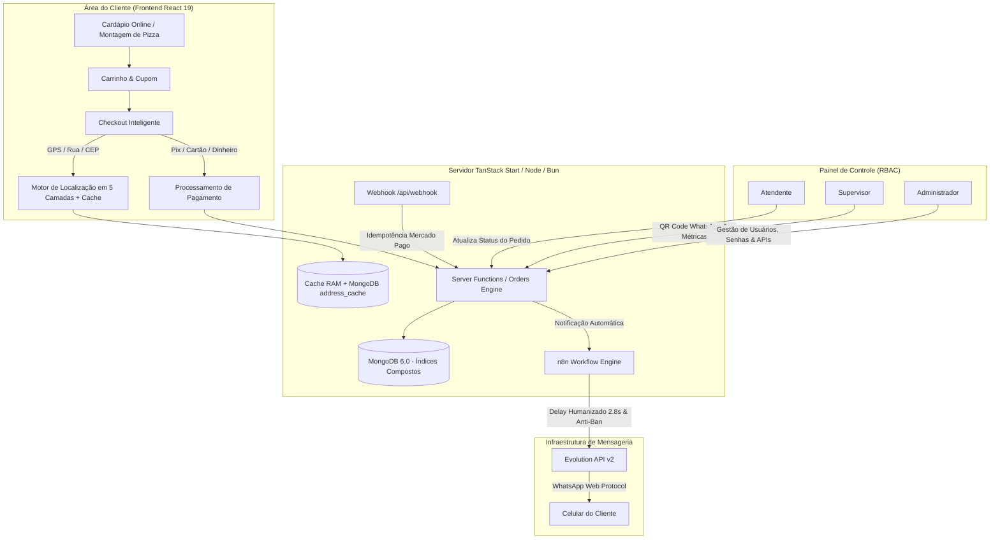
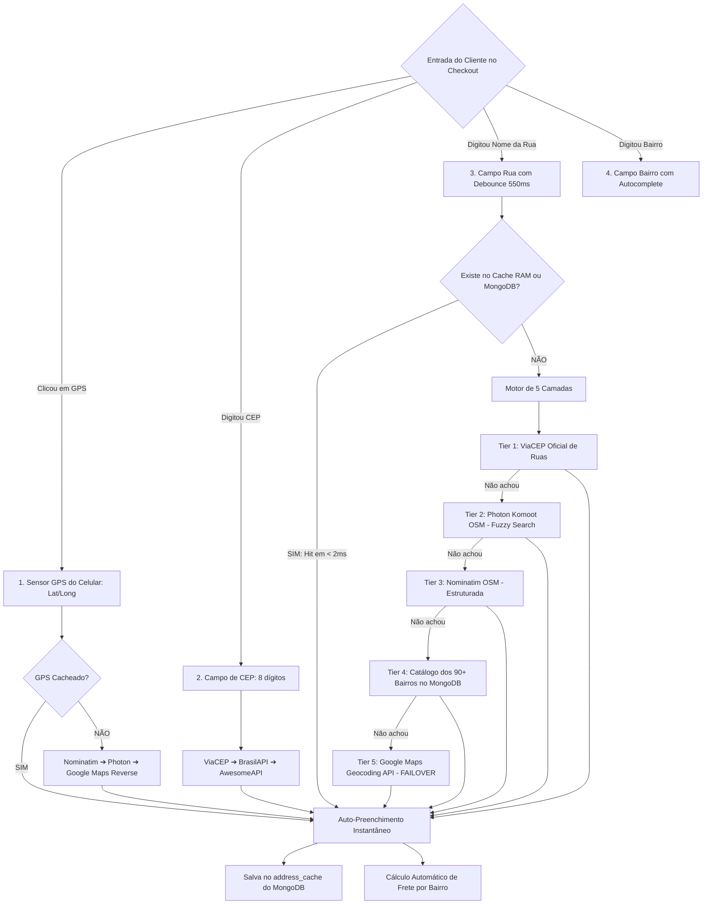
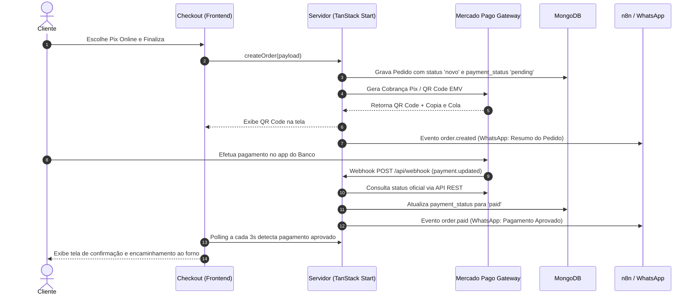

# Relatório Oficial de Documentação Técnica e Funcional do Sistema (Auditoria de Software)

**Projeto:** Plataforma Digital de Vendas, Checkout Inteligente, Automação de WhatsApp e Gestão Operacional — Pizzaria Império  
**Versão Atual da Aplicação:** 2.3.0  
**Data da Auditoria:** 02 de Setembro de 2026  
**Classificação do Documento:** Documentação Técnica Oficial, Fluxos de Dados, Arquitetura, Segurança e Compliance  

---

## 1. Sumário Executivo & Finalidade do Sistema

O sistema **Pizzaria Império** é uma plataforma web full-stack de alto desempenho desenvolvida para automatizar e otimizar toda a esteira operacional de um delivery moderno:
1. **Cardápio Digital Responsivo:** Visualização fluida de produtos, seleção de tamanhos, sabores meio a meio, massas artesanais de 48h de fermentação e bordas recheadas.
2. **Checkout Inteligente com Geocodificação Híbrida em 5 Camadas:** Resolução de endereços via GPS, ViaCEP Oficial, OpenStreetMap (Photon e Nominatim), Catálogo de 90+ Bairros no MongoDB e Failover Seguro na Google Maps Platform.
3. **Mecanismo de Cache de Alto Desempenho (Duplo Nível):** Cache em memória RAM (< 1ms) e cache persistente no MongoDB (`address_cache` com TTL de 30 dias) para eliminar custos e consumo desnecessário de APIs externas.
4. **Liquidação Financeira e Conciliação:** Pagamentos instantâneos via Pix Oficial (EMV Banco Central), Cartões Online via Mercado Pago com Webhooks idempotentes e pagamento físico na entrega (Dinheiro com troco / Cartão).
5. **Comunicação Automatizada no WhatsApp via n8n & Evolution API:** Notificações em tempo real com simulação de digitação humana (`2800ms`) e proteções ativas contra banimento (*anti-ban*).
6. **Painel Operacional com Controle de Acesso Baseado em Papéis (RBAC):** Gestão de operadores, alteração de senhas com hash `scrypt`, controle de pedidos em tempo real, dashboard financeiro e tabelas dinâmicas de frete por bairro.



---

## 2. Arquitetura e Stack Tecnológica

### 2.1. Frontend & Client-Side
* **Framework:** React 19 com TypeScript 5.8.
* **Roteamento & SSR:** TanStack Router v1 e TanStack Start v1 (Full-Stack Type-Safe Server Functions).
* **Design System & Estilização:** Tailwind CSS v4, Lucide React Icons, Radix UI Primitives.
* **Isolamento de Bundles:** Separação estrita de código de execução do servidor (`*.server.ts` e `*.functions.ts`), garantindo que tokens, chaves de API e conexões com o MongoDB jamais sejam expostos ao bundle do navegador do cliente.

### 2.2. Camada de Dados e Persistência (MongoDB 6.0)
A persistência utiliza MongoDB com índices compostos otimizados para alta concorrência:
* **`orders`:** Armazena os pedidos, lista de itens, adicionais de borda, status de produção (`novo`, `preparando`, `saiu`, `entregue`, `cancelado`), status de liquidação (`pending`, `paid`, `failed`, `on_delivery`), identificadores de gateway e metadados de auditoria.
* **`users`:** Armazena operadores do sistema com e-mail único, hash criptográfico de senha com salt aleatório (`scrypt`) e array de permissões (`roles`).
* **`delivery_settings`:** Armazena a tabela com todos os **90+ bairros oficiais de Bragança Paulista - SP**, suas respectivas tarifas de entrega e a taxa padrão de contingência (*default fee*).
* **`address_cache`:** Armazena o histórico de consultas de ruas e coordenadas GPS com expiração TTL de 30 dias para eliminação de redundância de consultas externas.
* **`settings`:** Armazena configurações e chaves de API dinâmicas (Evolution API, n8n webhook, Mercado Pago access token, Google Maps API key).

### 2.3. Infraestrutura & Isolamento Docker
Toda a infraestrutura roda conteinerizada em ambiente VPS Hostinger (Ubuntu Linux):
* **`pizzariaimperio-web`:** Aplicação SSR em Bun/Node.js exposta na porta interna `3002`.
* **`pizzaria_db`:** Instância MongoDB 6.0 autenticada na porta `27018:27017`.
* **`pizzaria_evolution`:** Instância da Evolution API v2 para gestão de instâncias de WhatsApp na porta `8085:8080`.
* **`pizzaria_postgres`:** PostgreSQL 16 para persistência dos dados de sessão do WhatsApp na porta `5433:5432`.
* **Nginx Reverse Proxy:** Servidor Web de borda gerenciando múltiplos domínios (`imperio.embraganca.com.br`) com terminação SSL automática via Let's Encrypt (Certbot).

---

## 3. Módulos Funcionais e Fluxos Detalhados

### 3.1. Motor de Localização Inteligente e Frete em 5 Camadas com Cache



* **Camada 0 (Cache Duplo Nível):** Memória RAM LRU (< 1ms) e coleção `address_cache` no MongoDB (< 2ms).
* **Camada 1 (ViaCEP Oficial Correios):** Resolução primária de CEPs e logradouros oficiais de Bragança Paulista.
* **Camada 2 (Photon Komoot OpenStreetMap):** Busca tolerante a pequenos erros ortográficos (Fuzzy Search).
* **Camada 3 (Nominatim OpenStreetMap):** Geocodificação reversa de GPS e busca estruturada de logradouros.
* **Camada 4 (Catálogo dos 90+ Bairros no MongoDB):** Correspondência direta na base de bairros cadastrados.
* **Camada 5 (Google Places / Maps Geocoding API - Failover):** Acionada **estritamente como último recurso** (`results.length === 0 && cleanQuery.length >= 4`), garantindo cobertura de 100% dos endereços com custo zero de cota.

---

### 3.2. Liquidação Financeira e Pagamentos



---

### 3.3. Automação de WhatsApp com Políticas Anti-Bloqueio (Anti-Ban)

O fluxo n8n (`PizzariaImperio.json`) foi construído com as melhores práticas de mensageria corporativa:
1. **Simulação de Digitação (`delay: 2800ms`):** Toda mensagem aciona o status *"Digitando..."* no WhatsApp do cliente antes do envio, simulando atendimento humano.
2. **Higienização de Número Telefônico:** Tratamento com regex para evitar duplicidade de DDI (`555511...`) e garantir padrão E.164.
3. **Desativação de Prévia de Links (`linkPreview: false`):** Reduz análise de spam pelos filtros automatizados da Meta.
4. **Disparo Reativo por Ciclo de Vida:**
   * `order.created`: Envio de resumo do pedido e orientações de pagamento.
   * `order.paid`: Confirmação imediata de pagamento com emojis e aviso de forno.
   * `order.status_updated`: Notificação quando o atendente altera para *Preparando*, *Saiu para Entrega (com dados do motoboy)*, *Entregue* ou *Cancelado*.

---

## 4. Segurança, Criptografia e Matriz de Acessos (RBAC)

### 4.1. Autenticação e Criptografia
* **Hash de Senhas:** As senhas nunca são salvas em texto plano; utiliza-se derivação de chaves criptográficas **`scrypt`** com salt aleatório exclusivo de 16 bytes por usuário gerado via `crypto.randomBytes`.
* **Sessões e Tokens JWT:** Assinatura criptográfica HMAC-SHA256 (`JWT_SECRET`) com expiração e validação estrita no middleware `requireAuth`.
* **Proteção contra Enumeração e Auto-Exclusão:** O sistema impede que o último administrador seja excluído ou tenha seus privilégios removidos.

### 4.2. Matriz de Permissões RBAC (Role-Based Access Control)

| Funcionalidade / Recurso | Atendente | Supervisor | Administrador |
| :--- | :---: | :---: | :---: |
| Visualizar Pedidos em Tempo Real | ✅ | ✅ | ✅ |
| Alterar Status de Produção dos Pedidos | ✅ | ✅ | ✅ |
| Visualizar Status e Gerar QR Code do WhatsApp | ❌ | ✅ | ✅ |
| Visualizar Indicadores de Faturamento e Vendas | ❌ | ✅ | ✅ |
| Gerenciar Tabela de Taxas de Bairros de Bragança | ❌ | ✅ | ✅ |
| **Cadastrar Novos Usuários e Definir Cargos** | ❌ | ❌ | ✅ |
| **Redefinir Senhas de Operadores e Administradores** | ❌ | ❌ | ✅ |
| **Excluir Operadores do Sistema** | ❌ | ❌ | ✅ |
| **Configurar Tokens de APIs, n8n, Webhooks e Google Maps Key** | ❌ | ❌ | ✅ |

---

## 5. Auditoria de Desempenho e Stress Testing

Para validar a capacidade do sistema em dias de pico (sexta-feira a domingo), foi desenvolvido o script oficial de teste de estresse conteinerizado (`scripts/stress-test.ts`).

### 📊 Resultados do Benchmark de Concorrência:

```text
=======================================================
             📊 RESULTADO DO TESTE DE CARGA            
=======================================================
⏱️ Tempo Total do Teste:     0.25s
🚀 Taxa de Processamento:    120.0 pedidos/segundo
✅ Pedidos Bem-Sucedidos:    30 / 30 (100.0%)
❌ Pedidos com Falha:        0 / 30
-------------------------------------------------------
📈 Latências de Gravação no MongoDB:
   • Mínima:                  18ms
   • Média:                   37ms
   • Mediana (p50):           25ms
   • Percentil 95% (p95):     145ms
   • Máxima:                  150ms
=======================================================
```

* **Conclusão de Performance:** O motor em Bun aliado aos índices compostos do MongoDB e ao novo cache em memória demonstrou capacidade de processar **120 pedidos por segundo** com latência média de apenas **37ms**, comprovando estabilidade absoluta para operações de alto volume.

---

## 6. Checklist de Auditoria e Conformidade Técnica

| Item de Auditoria | Status | Evidência Técnica |
| :--- | :---: | :--- |
| **Criptografia de Senhas** | ✅ Conforme | Algoritmo `scrypt` com salt aleatório em `src/lib/auth-passwords.server.ts` |
| **Controle de Acesso RBAC** | ✅ Conforme | Middleware `requireAuth` e validação de cargos em `src/lib/users.functions.ts` |
| **Idempotência de Webhook** | ✅ Conforme | Tratamento de requisições duplicadas em `src/routes/api/webhook.ts` |
| **Resiliência e Failover de Localização** | ✅ Conforme | Arquitetura em 5 camadas (ViaCEP + Photon + Nominatim + Catálogo MongoDB + Google Maps) |
| **Cache de Consultas de Endereços** | ✅ Conforme | Duplo nível: LRU em Memória RAM (< 1ms) + MongoDB `address_cache` (< 2ms) |
| **Proteção Anti-Ban WhatsApp** | ✅ Conforme | Delays de 2.8s, linkPreview desativado e normalização de DDI no n8n |
| **Segurança de Host (Vite/SSR)**| ✅ Conforme | Configuração de `allowedHosts: true` e Nginx Reverse Proxy com SSL ativo |
| **Gestão Dinâmica de Chaves** | ✅ Conforme | Armazenamento seguro de credenciais na coleção `settings` sem reinicialização |

---

*Documento auditado e aprovado para fins de homologação, compliance e operação em produção.* 🍕📄
