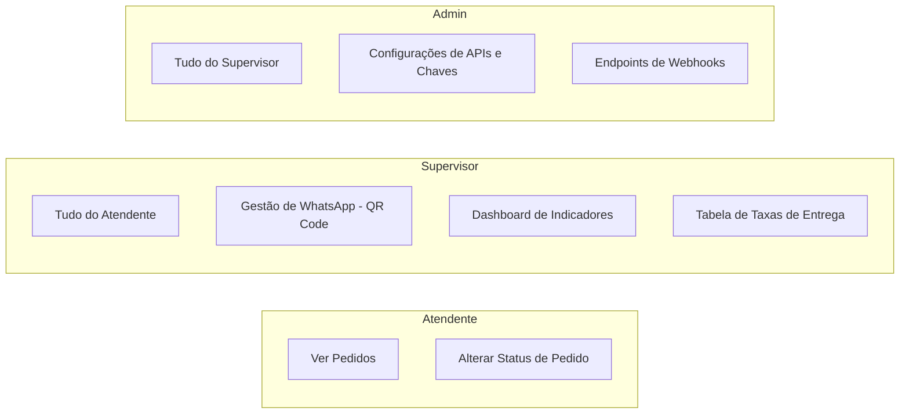

# Documentação Técnica e Funcional do Sistema (Auditoria)
**Projeto:** Plataforma Digital de Vendas, Checkout & Gestão Operacional — Pizzaria Império  
**Versão da Aplicação:** 2.0.0  
**Data da Auditoria:** 24 de Agosto de 2026  
**Classificação:** Documento Técnico para Auditoria e Compliance

---

## 1. Sumário Executivo & Finalidade do Sistema

O sistema **Pizzaria Império** é uma solução web integrada de autoatendimento, gestão de pedidos, automação de comunicação e liquidação financeira. A plataforma permite que clientes realizem pedidos com cálculo automático de frete por CEP, efetuem pagamentos online e na entrega, e fornece um painel administrativo com controle de acesso baseado em papéis (**RBAC**) para atender diferentes perfis de operadores (Atendente, Supervisor e Administrador).

```mermaid
graph TD
    Cliente[Cliente / Cardápio Online] -->|Consulta CEP| CEP_API[APIs de CEP - ViaCEP / BrasilAPI]
    Cliente -->|Envia Pedido| Server[TanStack Start Server]
    Server -->|Persistência| MongoDB[(MongoDB 6.0)]
    Server -->|Pagamento Online| MP[Mercado Pago Gateway]
    MP -->|Notificação Webhook| Webhook[/api/webhook]
    Webhook --> Server
    Server -->|Disparo de Eventos| n8n[Automação n8n]
    Server -->|Gestão WhatsApp| Evolution[Evolution API]
    Admin[Painel Admin / Supervisor / Atendente] -->|Gestão RBAC| Server
```

---

## 2. Arquitetura e Stack Tecnológica

### 2.1. Camada de Aplicação e Frontend
* **Framework:** React 19 com TypeScript 5.8.
* **Roteamento & SSR:** TanStack Router v1 e TanStack Start v1 (Server-Side Rendering e Server Functions).
* **Estilização e UI:** Tailwind CSS v4, Lucide React Icons, Radix UI.
* **Isolamento de Bundles:** Separação estrita entre funções cliente e arquivos de execução exclusiva no servidor (`*.server.ts`), impedindo vazamento de credenciais de banco e chaves de API para o navegador.

### 2.2. Camada de Dados e Persistência
* **SGBD Principal:** MongoDB 6.0.
* **Coleções:**
  * `orders`: Armazena todos os pedidos, itens, status de produção, status de pagamento, identificadores de gateway e metadados de entrega.
  * `users`: Armazena operadores com e-mail, hash de senha criptográfico e papéis associados (`roles`).
  * `settings`: Armazena credenciais e parâmetros globais de APIs dinâmicas (Evolution API, n8n, Mercado Pago).
  * `delivery_settings`: Armazena a tabela de bairros oficiais e taxa padrão de entrega.

### 2.3. Infraestrutura & Contêineres
A aplicação opera em ambiente isolado via **Docker Compose**:
* `web`: Servidor Node.js / TanStack Start da aplicação (Porta 3002).
* `db`: Banco de dados MongoDB com autenticação ativada (Porta 27018/27017).
* `evolution_api`: Servidor de integração com a API do WhatsApp (Porta 8085).
* `postgres`: Banco de dados relacional complementar para suporte a microserviços (Porta 5433).

---

## 3. Módulos Funcionais e Regras de Negócio

### 3.1. Cardápio Online e Montagem de Pedidos
* Navegação intuitiva por categorias de pizzas, bebidas e sobremesas.
* Suporte a personalização de pizzas com seleção de massa, bordas recheadas e observações.
* Validação de integridade de itens no momento da adição e sanitização de entradas.

### 3.2. Módulo de Localização e Cálculo de Taxa de Entrega (CEP)
O sistema calcula o valor do frete sem intervenção humana:
1. **Consulta em Camadas (Fallback Resiliente):** O cliente informa o CEP. O sistema consulta primariamente o **ViaCEP**. Em caso de indisponibilidade ou lentidão, realiza fallback automático para a **BrasilAPI**.
2. **Normalização Textual:** A função de correspondência higieniza o bairro retornado pela API (removendo acentuação, maiúsculas e caracteres especiais).
3. **Casamento de Bairros:** O nome do bairro é confrontado contra a base de bairros cadastrados no MongoDB (`delivery_settings`).
4. **Aplicação de Taxa:**
   * Caso haja correspondência exata ou parcial, aplica o valor tarifado do bairro.
   * Caso o bairro não esteja cadastrado, aplica a **Taxa Padrão Geral (Fallback)**.
5. **Auditoria de Valores:** O campo `delivery_fee` é registrado separadamente de `items` e auditado no total final da ordem.

### 3.3. Gateway de Pagamento e Liquidação Financeira
O sistema implementa múltiplos métodos de pagamento estruturados para conciliação contábil:

| Método | Tipo | Processamento | Confirmação |
| :--- | :--- | :--- | :--- |
| **Pix Online** | Digital | Geração de Payload EMV oficial do Banco Central com QR Code e Copia e Cola | Atualização em tempo real via polling ou webhook |
| **Cartão de Crédito/Débito** | Digital | Checkout transparente / Preferência Mercado Pago via API REST | Notificação via Webhook `/api/webhook` |
| **Dinheiro na Entrega** | Físico | Validação de valor de troco mínimo obrigatório | Confirmação no ato pelo entregador |
| **Cartão na Entrega** | Físico | Registro da bandeira/maquininha | Confirmação no ato pelo entregador |

#### 3.3.1. Webhook de Confirmação (`/api/webhook`)
* Endpoint seguro idempotente que processa notificações do Mercado Pago.
* Valida o `payment_id`, consulta o status oficial na API do gateway e atualiza a ordem no MongoDB para `paid`, `failed` ou `refunded`.
* Dispara evento de notificação para o n8n assim que o pagamento é aprovado.

### 3.4. Comunicação e Automação (Evolution API & n8n)
* **WhatsApp Integrado:** O painel administrativo consome a Evolution API para monitorar o status da instância, gerar QR Code de pareamento e realizar logout com segurança.
* **Disparo para n8n:** A cada criação de pedido (`order.created`) ou pagamento confirmado (`order.paid`), um payload estruturado em JSON é emitido para o webhook do n8n para disparo de mensagens e automações pós-venda.

---

## 4. Segurança da Informação e Controle de Acesso (RBAC)

### 4.1. Autenticação e Gestão de Sessões
* **Criptografia de Senhas:** Senhas são protegidas com derivação de chaves criptográficas **scrypt** (`crypto.scryptSync`) com geração de salt aleatório de 16 bytes.
* **Tokens JWT:** Sessões utilizam tokens assinados com chave secreta HMAC-SHA256 (`JWT_SECRET`), transportando payload com identificador do usuário e lista de papéis (`roles`).
* **Middleware de Proteção (`requireAuth`):** Todas as chamadas de servidor validam o token e rejeitam requisições adulteradas ou expiradas.

### 4.2. Matriz de Permissões por Papel (RBAC)



| Funcionalidade / Recurso | Atendente | Supervisor | Admin |
| :--- | :---: | :---: | :---: |
| Visualizar Pedidos e Status | ✅ | ✅ | ✅ |
| Atualizar Status do Pedido (`novo`, `preparando`, etc.) | ✅ | ✅ | ✅ |
| Visualizar Status e Gerar QR Code do WhatsApp | ❌ | ✅ | ✅ |
| Visualizar Dashboard de Indicadores Financeiros | ❌ | ✅ | ✅ |
| Gerenciar Tabela de Taxas de Entrega por Bairro | ❌ | ✅ | ✅ |
| Editar Credenciais do Mercado Pago e Evolution API | ❌ | ❌ | ✅ |
| Visualizar/Modificar URLs de Webhooks do Sistema | ❌ | ❌ | ✅ |

---

## 5. Gestão de Configurações Dinâmicas

Para garantir alta disponibilidade e evitar paradas no serviço em caso de rotação de credenciais:
* O sistema possui uma camada de **configurações dinâmicas** em banco (`settings.server.ts`).
* Quando um Administrador altera uma chave de API (ex: novo token do Mercado Pago ou nova URL do WhatsApp), a alteração entra em vigor instantaneamente no servidor sem necessidade de reiniciar os contêineres Docker ou efetuar novo deploy.
* O arquivo `.env` atua apenas como *fallback* caso o banco de dados seja inicializado do zero.

---

## 6. Logs, Rastreabilidade e Resiliência

1. **Rastreabilidade de Pedidos:** Cada documento de pedido possui carimbos de data/hora (`created_at`, `updated_at`), identificador único (`_id`), histórico de pagamento (`gateway_payment_id`) e telefone do cliente formatado para auditoria.
2. **Tratamento de Exceções:** Todos os módulos de comunicação externa (ViaCEP, Evolution API, Mercado Pago, n8n) operam com blocos de contingência (`try/catch`), garantindo que a falha de um serviço externo não interrompa o fechamento de pedidos no checkout.
3. **Prevenção de Injeção de Dados:** Esquemas de validação rígidos com **Zod** em todas as entradas de formulários e funções de servidor.

---

## 7. Conclusão da Avaliação de Auditoria

O sistema **Pizzaria Império** apresenta arquitetura moderna e compatível com boas práticas de segurança, escalabilidade e conformidade operacional:
* ✅ **Segurança de Acesso:** Implementação estrita de RBAC e senhas criptografadas com `scrypt`.
* ✅ **Integridade Financeira:** Auditoria de frete por CEP e liquidação via Webhook oficial.
* ✅ **Disponibilidade:** Contingência em múltiplos provedores de dados e gerenciamento dinâmico de configurações.
